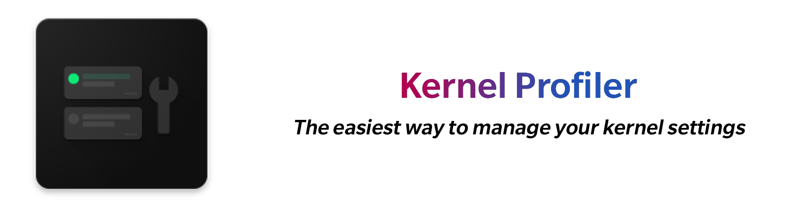

## Download

## Requirements
* ROOT Access
* Kernel-level support

## Features
* Switch between profiles (no limit) provided by the kernel developer in one click (for users).
* Apply *default* profile, pre-defined by the developer or assigned by the user, on boot
* Completely (almost) customise the interface of app in accordance with kernel (for developers).
* Easily create profiles and necessary configuration file within the app (for developers).

## How to add support in kernel
Kernel Profiler expects a configuration file (*<b>kernelprofiler.json</b>*) and one or more *<b>profiles</b>* (basically shell scripts) in certain specific structure placed inside *<b>"/data/kernel_profiler"</b>*.

### Structure of *kernelprofiler.json*
*<b>kernelprofiler.json</b>* necessorily contains a *<b>title</b>* string as well as a number of optional strings to properly identify a specific kernel. An example *<b>kernelprofiler.json</b>* can be found [here](https://raw.githubusercontent.com/sunilpaulmathew/android_kernel_oneplus_msm8998/oneplus/QC8998_Q_10.0_Beta/AnyKernel/ramdisk/kernel_profiler/kernelprofiler.json).

* "<b>title</b>": "Title of your kernel". The "<b>title</b>" should be a string from your kernel's "<b>uname -a</b>". It will be later matched on your user's devices, and also be displayed as app's main title. *<b>Please note</b>* that it is the only way of app to distinguish a supported kernel and should be done carefully.

* "<b>description</b>": "A short description (in one line) about your kernel". *<b>Please note</b>* that the "<b>description</b>" string will be also displayed in app along with the main title.

* "<b>default</b>": "The exact name of the default profile including *<b>.sh</b>* extension".

* "<b>developer</b>": "The identity (name, pet name or anything similar) of the developer". *<b>Please note</b>* that the "<b>developer</b>" string will be displayed in app along with a *©* symbol (bottom part of app).

* "<b>support</b>": "A link to the discussion page or a support group of your kernel". *<b>Please note</b>* that the "<b>support</b>" string will be linked to the app's settings menu.

* "<b>donations</b>": "A link to send donations to the developer". *<b>Please note</b>* that the "<b>donations<b>" string will also be linked to the app's settings menu.

### Structure of *profiles* (shell scripts)
App considers any properly formatted shell script as a *<b>profile</b>*. Optionally, the developer may add a line starting with "<b>*# Description=*</b>" somewhere in the *<b>profile</b>* so that the app will recognize and display it as the *<b>profile description</b>*. An example *<b>profile</b>* can be found [here](https://raw.githubusercontent.com/sunilpaulmathew/android_kernel_oneplus_msm8998/oneplus/QC8998_Q_10.0_Beta/AnyKernel/ramdisk/kernel_profiler/Default.sh).

## How to integrate into an Anykernel zip
Adding the following lines into *<b>anykernel.sh</b>* after placing all the support files, such as a properly formatted *<b>kernelprofiler.json</b>* and one or more *<b>profile</b>* scripts, into *<b>ramdisk/kernel_profiler</b>*, allow you to inject Kernel Profiler support upon kernel installation.

>     if [ -e $ramdisk/kernel_profiler ]; then
>     	# Inject Kernel Profiler support
>     	if [ -e /data/kernel_profiler ]; then
>     		# Remove old files
>     		rm -rf /data/kernel_profiler/*
>     		mv $ramdisk/kernel_profiler/* /data/kernel_profiler/
>     	else
>     		mv ramdisk/kernel_profiler/ /data/
>     	fi
>     fi

The following commit shall be used for further reference
* [AnyKernel: Introduce Kernel Profiler support](https://github.com/sunilpaulmathew/android_kernel_oneplus_msm8998/commit/43dffe1d2de8c93ba852943a9eb9bf9649d47993)

## Translations
Please help me to translate this app. The original english string of this app is available at
>     https://github.com/SmartPack/KernelProfiler/blob/master/app/src/main/res/values/strings.xml

## Support

## Donations
If you like to appreciate my work, please consider donating to me (either via [PayPal](https://www.paypal.me/menacherry/), or [Ko-fi](https://ko-fi.com/sunilpaulmathew/), or by purchasing the [SmartPack Donation Package](https://play.google.com/store/apps/details?id=com.smartpack.donate) from playstore) as it is helpful to continue my projects more active, although it is not at all necessary.
Please Note: Purchasing [SmartPack Donation Package](https://play.google.com/store/apps/details?id=com.smartpack.donate) will remove Ads on this app.

## Credits
* [Grarak](https://github.com/Grarak), Kernel Adiutor, from where I took a lot of code
* [topjohnwu](https://github.com/topjohnwu), libsu
* [Lennoard Silva](https://github.com/Lennoard), Code contributions, App Icon, & Portuguese (Brazilian) Translation
* [tsiflimagas](https://github.com/tsiflimagas), Greek Translations
* [SmgKhOaRn](https://github.com/FiestaLake), Greek Translations

## Report a bug or request a feature

You can report a bug or request a feature by [opening an issue](https://github.com/SmartPack/KernelProfiler/issues/new).

## License

    Copyright (C) 2020-2021 sunilpaulmathew <sunil.kde@gmail.com>

    Kernel Profiler is a free softwares: you can redistribute it and/or
    modify it under the terms of the GNU General Public License as published
    by the Free Software Foundation, either version 3 of the License, or (at
    your option) any later version.

    Kernel Profiler is distributed in the hope that it will be useful, but
    WITHOUT ANY WARRANTY; without even the implied warranty of MERCHANTABILITY
    or FITNESS FOR A PARTICULAR PURPOSE. See the GNU General Public License
    for more details.

    You should have received a copy of the GNU General Public License along
    with Kernel Profiler. If not, see <http://www.gnu.org/licenses/>.